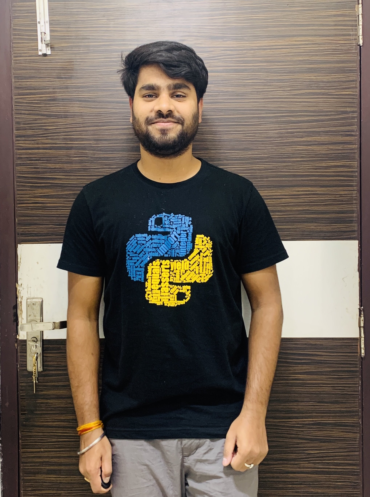

# AI Interview Preparation

Selection in big companies requires an aspirant to be proficient in coding as well as fluent in his words. The latter sometimes becomes a major anchor for various students with the ability to achieve high otherwise. This is a problem that our current interface looks at resolving. We are building an interface that helps users with a situation by the use of an AI that asks questions on the basis of a code which the aspirant has written, asked from a diverse pack of frequently asked coding questions. Then the AI asks the aspirant questions related to his code and some staple questions. At the end of this experience, the user receives his interview profile showing him his flaws in answering questions, his fluency, and his ability to handle the situation verbally. This can be done on various levels and be stored for future scrutiny by the user. We can also provide a growth curve that helps the aspirant to judge his progress.

## ❤️ Project Admin

<table>
	<tr>
		<td align="center">
			<a href="https://github.com/aryasoni98">
				
				  <b>Arya Soni</b>
			</a>
			  <a href="https://github.com/aryasoni98">
		👑 Admin
	    </a>
		</td>
	</tr>
</table>
